# IIS Log Parser for ArcGIS

A .NET console application that turns daily IIS W3C log files from an ArcGIS Server/Portal deployment into small, queryable daily aggregate tables in SQLite — without ever persisting a single raw log line.

Run once per day (e.g. from Windows Task Scheduler) against a log source directory, a target local date, and an output database path, it discovers the right file(s) for that day, parses and normalizes every line, computes ten aggregate views in memory, and atomically replaces that day's rows in the output database.

## Why this exists

The organization runs ArcGIS Server and Portal behind IIS. Operators need to answer questions like *"which endpoints are busiest?"*, *"which ArcGIS services are failing?"*, *"who's driving load?"* — but the only source of truth is raw, daily-rotated IIS log files. Keeping raw rows around indefinitely isn't wanted, and re-running a day's processing (e.g. after a bug fix) must never double-count that day's totals.

## What it does

For a given local calendar date, the program:

1. **Discovers** the physical log file(s) needed to cover that local day, including a UTC-adjacent file when the configured time zone offset requires it.
2. **Parses** every line, resolving fields **by name** from each file's own most-recently-seen `#Fields` header — never by a hard-coded position — so field order/count drift across the deployment's history doesn't break anything.
3. **Normalizes** each valid line into a shared request model (UTC timestamp, local timestamp, local date, and the raw field values every aggregate needs).
4. **Aggregates** that day's requests, in memory, into ten dimensions (see [Output schema](#output-schema-ten-aggregate-tables)).
5. **Replaces** that day's rows across all ten tables in one atomic transaction — re-running a day is always a full replace, never an append. (The one optional exception is the by-referer-and-URI table, which is left untouched unless `ComputeByRefererAndUri` is `true`.)
6. **Reports** a run summary (lines read/valid/invalid, elapsed time) and fails loudly (non-zero exit code, clear message) if no input files are found.

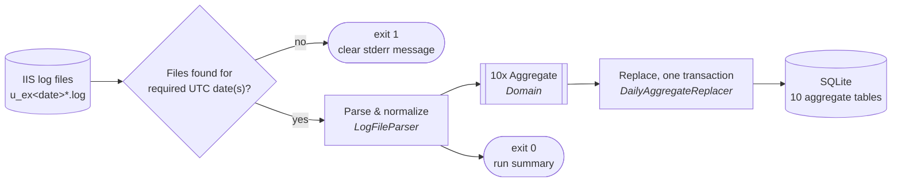

Full behavioral spec: [`requirements.md`](requirements.md) and [`.scratch/iis-log-parser/spec.md`](.scratch/iis-log-parser/spec.md). Project vocabulary (Hit, Daily Batch, Root/Site, etc.): [`CONTEXT.md`](CONTEXT.md).

## Quick start

### Prerequisites

- .NET SDK 10 (`dotnet --version` → `10.0.x`)

### Build & test

```powershell
dotnet build IisLogParserArcGIS.slnx
dotnet test IisLogParserArcGIS.slnx
```

### Configure

Edit `src/IisLogParserArcGIS/appsettings.json` (or add an environment-specific overlay, see [Configuration](#configuration)). This is this deployment's own real, committed configuration — replace `IncludedRoots`, `PortalBaseUrl`, and `ArcGisServerBaseUrl` with your own site names and hosts:

```json
{
  "LocalTimeZone": "America/Edmonton",
  "LogOutputDirectory": "Logs",
  "LogLevel": "Warning",
  "PortalWebAdaptorName": "portal",
  "IncludedRoots": ["arcgis", "charon", "deimos", "europa", "galatea", "iapetus", "kerberos", "mimas", "namaka", "oberon", "phobos", "rhea", "titan", "umbriel"],
  "PortalBaseUrl": "geospatial.alberta.ca/portal",
  "ArcGisServerBaseUrl": "geospatial.alberta.ca",
  "OutputDirectory": "Dashboard"
}
```

### Run

The compiled executable is driven by one of three verbs. There is no default — every invocation must name one:

```powershell
IisLogParserArcGIS.exe harvest <logSourceDirectory> <targetLocalDate:yyyy-MM-dd> <outputDatabasePath>
IisLogParserArcGIS.exe regenerate <inputDatabasePath>
IisLogParserArcGIS.exe harvest-regenerate <logSourceDirectory> <targetLocalDate:yyyy-MM-dd> <outputDatabasePath>
```

| Verb | Does | Use it for |
| --- | --- | --- |
| `harvest` | A Harvest Run only — parses one Local Date's logs and replaces that date's Daily Batch. Never touches the Dashboard. | Backfilling many dates (see below), where regenerating after every date would be wasted work. |
| `regenerate` | A Regeneration Run only — rebuilds the entire Dashboard from an existing aggregate database's current contents. Never harvests. | Refreshing the Dashboard on demand, or as the last step of a backfill. |
| `harvest-regenerate` | Both, in sequence — today's routine, single-date behavior. | The day-to-day scheduled run (e.g. Windows Task Scheduler). |

```powershell
IisLogParserArcGIS.exe harvest-regenerate "D:\IISLogs" 2026-03-06 "D:\Aggregates\usage.sqlite"
```

Typical output:

```
2026-03-07 00:05:00.123 -05:00 [WRN] Starting IisLogParserArcGIS: source directory=D:\IISLogs, target local date=03/06/2026, output database=D:\Aggregates\usage.sqlite
2026-03-07 00:05:00.245 -05:00 [WRN] Run summary: 1992 line(s) read, 1992 valid, 0 invalid/skipped, elapsed 0.06s.
```

A non-zero exit code and a clear stderr message mean something needs attention — most commonly *no log files found for the required date(s)*, or an invalid CLI argument or verb.

### Backfilling a range of dates

Each of `harvest`/`harvest-regenerate` processes exactly one local date per run. To process a whole backlog of log files (e.g. a full year) into one output database without modifying the CLI, use `Scripts\Invoke-IisLogBackfill.ps1`, copied next to the executable at build time. It scans a log source directory for every distinct UTC date embedded in `u_ex<YYMMDD>*.log` file names, invokes `harvest` once per date in sequence against the same output database, then invokes `regenerate` exactly once after the loop finishes — so a full year's backfill regenerates the Dashboard once, not once per date:

```powershell
Scripts\Invoke-IisLogBackfill.ps1 -LogSourceDirectory "D:\IISLogs" -OutputDatabasePath "D:\Aggregates\usage.sqlite"
```

A date whose invocation fails (e.g. a missing adjacent-day file) is recorded and the run continues with the next date; the script prints a final summary of how many dates succeeded/failed and exits non-zero if any date failed. The final `regenerate` call runs unconditionally, even if every date failed. This only derives the correct date when the configured `LocalTimeZone` is `UTC` — see the script's comment-based help (`Get-Help .\Invoke-IisLogBackfill.ps1 -Full`) for the exact boundary-case caveat.

## Configuration

One executable, one shared configuration file: bound from `appsettings.json`, overlaid with `appsettings.{DOTNET_ENVIRONMENT}.json` when present (e.g. `appsettings.Development.json` sets `LogLevel: Debug` for local development). Every run harvests that day's logs *and* regenerates the Dashboard in the same process (see [One run, end to end](#one-run-end-to-end)), so both sets of settings below live in this one file - there's no separate config file for the Dashboard/Reports side.

Any setting can also be overridden for a single run with an environment variable named `IISLOGPARSER_<Key>` (for example `IISLOGPARSER_LocalTimeZone=UTC`), applied last. Only variables carrying that prefix are ever read, so an ordinary machine-wide variable such as `LogLevel` cannot change behavior by accident. The regression and Reports test suites use this to pin the time zone to UTC for the executable they launch, because their line-count oracles assume a request's local date is its raw UTC date while this file's `LocalTimeZone` is the deployment's real one.

| Key                  | Default     | Meaning                                                                                                   |
| -------------------- | ----------- | ----------------------------------------------------------------------------------------------------------- |
| `LocalTimeZone`      | `UTC`       | A `TimeZoneInfo`-compatible ID (IANA, e.g. `America/Edmonton`, or a Windows ID). Drives `local_date`/`local_date_time` derivation for harvesting *and* the Dashboard's "today"/"this year" boundaries - keep these two uses in mind, since it's read once and used for both. |
| `LogOutputDirectory` | `Logs`      | Where the rolling application log file is written (relative to the executable, or absolute).                |
| `LogLevel`           | `Warning`   | Minimum level for the application's *own* code. `Microsoft.*` framework namespaces are always pinned at `Error`, regardless of this setting. |
| `PortalWebAdaptorName` | `portal`  | This deployment's ArcGIS Portal Web Adaptor name (case-insensitive match). Drives which `cs-uri-stem` values are recognized as Portal item-access requests for the by-Portal-item aggregate. |
| `ComputeByRefererAndUri` | `false` | Whether a harvest computes and stores the by-referer-and-URI aggregate. It is by far the highest-cardinality table (one row per referer + raw URI pair per day) and nothing in the Dashboard reads it, so it is off by default to keep the database small. With `false` the `aggregated_by_referer_and_uri` table still exists but the harvest neither writes to it nor deletes rows an earlier run stored, and it logs a warning saying so; with `true` it behaves as before. Changing the value does not shrink an existing database: to reclaim the space, empty the table and `VACUUM` a copy (which needs roughly the database's size in free disk space). |
| `IncludedRoots`      | `[]`        | Flat, lowercase allow-list of Root/Site names shown in the Dashboard's ArcGIS Server section. A Root present in the aggregate database but absent from this list is silently excluded from every report. |
| `PortalBaseUrl`      | `""`        | This deployment's ArcGIS Portal base URL: the host, plus whatever path prefix (typically a Web Adaptor name) is actually needed to reach Portal's own web pages there - e.g. `portal.example.com` when Portal sits at the domain root, or `geospatial.example.gov/portal` when it doesn't. No scheme - always linked as `https://`. Used to link every Portal Item reference in the Dashboard to that item's live page on Portal. |
| `ArcGisServerBaseUrl` | `""`       | This deployment's ArcGIS Server base host. Unlike `PortalBaseUrl`, every site (Included Root) is a top-level path segment on this one shared host rather than a host of its own - e.g. `geospatial.example.gov`, with a service reachable at `https://geospatial.example.gov/{site}/rest/services/...`. No scheme - always linked as `https://`. Used to link every ArcGIS Server service reference in the Dashboard to that service's own live REST endpoint. |
| `OutputDirectory`    | `Dashboard` | Where each run (re)generates the Dashboard (relative to the executable, or absolute). Always a full rebuild - a prior run's output is replaced, never merged with.                |

Logging goes to both the console and a rolling file (10 MB rollover, last 10 files retained) under `LogOutputDirectory`, one plain templated line per event.

## Output schema (ten aggregate tables)

Every table shares the same shape: a `local_date`, one or more dimension columns, an accumulated `time_taken_second`, and a `hits` count. The ArcGIS-service and Portal-item tables additionally split `hits` into `successful_hits`/`failed_hits`. The Field Maps and Survey123 device tables have no such split (they exist to show *who is using* those apps, not whether individual requests succeeded) and carry a nullable `username`.

```mermaid
erDiagram
    aggregated_by_uri {
        int id PK
        text local_date
        text uri_stem
        real time_taken_second
        int hits
    }
    aggregated_by_root {
        int id PK
        text local_date
        text root
        real time_taken_second
        int hits
    }
    aggregated_by_user_agent {
        int id PK
        text local_date
        text user_agent
        real time_taken_second
        int hits
    }
    aggregated_by_referer {
        int id PK
        text local_date
        text referer
        real time_taken_second
        int hits
    }
    aggregated_by_forwarded_for_ip {
        int id PK
        text local_date
        text forwarded_for_ip
        real time_taken_second
        int hits
    }
    aggregated_by_referer_and_uri {
        int id PK
        text local_date
        text referer
        text uri_stem
        real time_taken_second
        int hits
    }
    aggregated_by_arcgis_service {
        int id PK
        text local_date
        text site
        text folder "nullable"
        text service_name
        text service_type
        real time_taken_second
        int hits
        int successful_hits
        int failed_hits
    }
    aggregated_by_portal_item {
        int id PK
        text local_date
        text portal_item_id
        real time_taken_second
        int hits
        int successful_hits
        int failed_hits
    }
    aggregated_by_field_maps_device {
        int id PK
        text local_date
        text device_id
        text username "nullable"
        real time_taken_second
        int hits
    }
    aggregated_by_survey123_device {
        int id PK
        text local_date
        text device_id
        text username "nullable"
        real time_taken_second
        int hits
    }
```

| Table                            | Grouping key                                | Normalization highlights |
| --------------------------------- | -------------------------------------------- | ------------------------- |
| `aggregated_by_uri`               | `uri_stem`                                   | Truncated to 1024 chars. |
| `aggregated_by_root`              | `root`                                       | First path segment, lowercased, truncated to 16 chars, `-` when absent. |
| `aggregated_by_user_agent`        | `user_agent`                                 | `+` → space, lowercased, truncated to 1024 chars. |
| `aggregated_by_referer`           | `referer`                                    | `-`/empty pass through as-is; otherwise `+` → space, lowercased, truncated to 4096 chars. |
| `aggregated_by_forwarded_for_ip`  | `forwarded_for_ip`                           | `X-Forwarded-For` is optional (IIS only logs it when configured to) — lines whose governing header never declared it are silently excluded from this table only. First IP from a comma/colon-separated, possibly `+`-encoded list; loopback placeholder when the field is declared but its value is empty/`-`; truncated to 48 chars. |
| `aggregated_by_referer_and_uri`   | `(referer, uri_stem)`                        | Composed from the two normalizations above. Only populated when `ComputeByRefererAndUri` is `true` (default `false`); the table always exists. |
| `aggregated_by_arcgis_service`    | `(site, folder, service_name, service_type)` | Parsed from `/site/rest/services/[folder/]service_name/service_type/...`; admin (`/site/admin/*`) and Portal (`/portal/*`) traffic excluded; `hits = successful_hits + failed_hits` always. |
| `aggregated_by_portal_item`       | `portal_item_id`                             | Parsed from the configured Portal Web Adaptor's Sharing REST item-access endpoints (direct, user-scoped, or user+folder-scoped); username, folder id, and trailing sub-resource/operation are read structurally but discarded; opaque, truncated to 64 chars; `hits = successful_hits + failed_hits` always. |
| `aggregated_by_field_maps_device` | `device_id`                                  | ArcGIS Field Maps requests only (`arcgis-fieldmaps` in the user-agent). `device_id` is the GUID in the user-agent's trailing parenthesised group, casefolded. `username` is the casefolded username from that device's successful `community/users/<username>` login line — filled in the same run when the device logged in that day, otherwise back-filled afterwards from any other date (see [Field Maps username matching](#domain-field-maps-username-matching)), otherwise `NULL`. Indexed on `device_id`. |
| `aggregated_by_survey123_device`  | `device_id`                                  | ArcGIS Survey123 requests only (`AppFramework` **and** `Survey123` in the user-agent). `device_id` is the 32-hex id (no hyphens) that is the last `;+`-separated item of the user-agent's first parenthesised group, casefolded. `username` is attributed exactly as for Field Maps (see [Survey123 username matching](#domain-survey123-username-matching)). Indexed on `device_id`. |

Tables are created idempotently (`CREATE TABLE IF NOT EXISTS`) on every run — no migration framework. Schema: [`AggregateDatabaseSchema.cs`](src/IisLogParserArcGIS.Data/Schema/AggregateDatabaseSchema.cs).

## Architecture

### Solution layout

Four `src/` projects, each a distinct concern, plus one mirrored xUnit test project per `src/` project and a separate end-to-end regression project (see [ADR 0004](docs/adr/0004-solution-layout-mirrored-tests.md)):

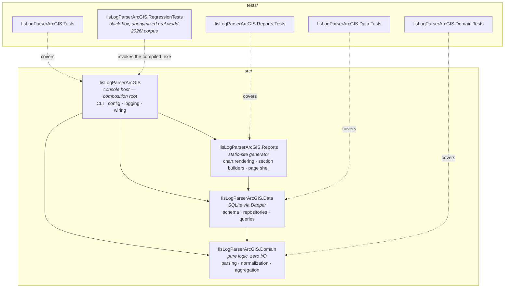

- **Domain** has zero database or filesystem dependencies — every parsing/normalization/aggregation rule is exhaustively unit-testable against synthetic fixtures.
- **Data** owns the SQLite schema and all Dapper SQL; CRUD per table lives in a dedicated Repository, non-CRUD/reporting queries live in separate Query classes ([ADR 0002](docs/adr/0002-dapper-repository-and-query-split.md)).
- **Reports** turns the aggregate database's current contents into the static-HTML Dashboard on every run ([ADR 0005](docs/adr/0005-pregenerate-dashboard-as-static-html.md)) — it queries `Data` directly (via its own Query classes) and never touches `Domain`, since it only ever reads already-aggregated rows, never a raw log line. See [Reports: Dashboard generation](#reports-dashboard-generation) below.
- **Host** is the only project that knows about the CLI, `appsettings.json`, and Serilog — it wires Domain, Data, and Reports together and is the *only* thing `RegressionTests` runs, as a compiled black box.

### One run, end to end

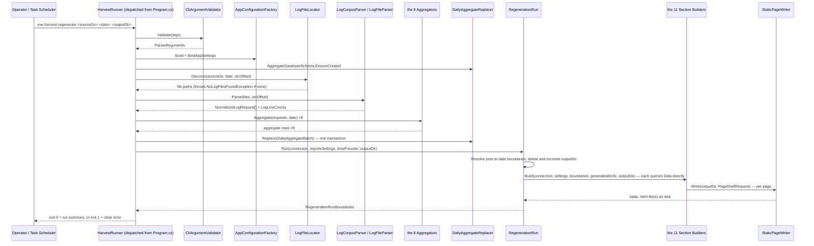

### File discovery: which files, and when it fails

Split Domain/Host on purpose: [`RequiredUtcDatesCalculator`](src/IisLogParserArcGIS.Domain/FileDiscovery/RequiredUtcDatesCalculator.cs) (Domain, pure) decides *which* UTC calendar date(s) a local day needs, given the configured offset's sign; [`LogFileLocator`](src/IisLogParserArcGIS/FileDiscovery/LogFileLocator.cs) (Host) does the actual filesystem glob — `u_ex<YYMMDD>*.log`, treating everything after the UTC date as one opaque wildcard. The program never inspects, parses, or branches on what follows the date (a trailing site-ID/server segment, in this deployment's own naming convention, is one example of something that lands there) — a file's schema comes only from its own `#Fields` header, never from its name.

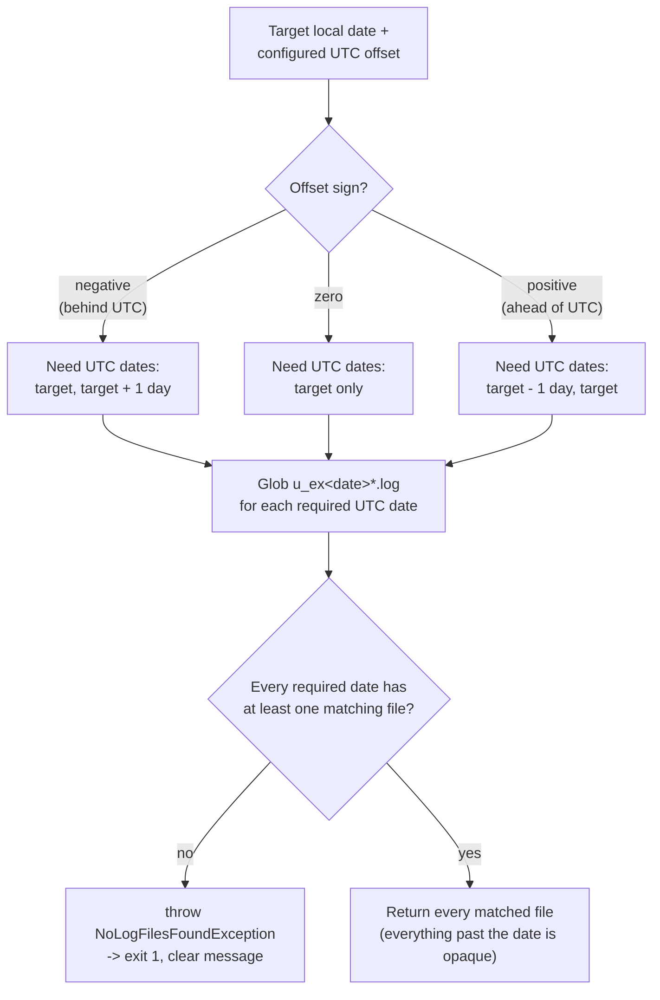

A missing date is treated the same as no files at all — a partially-arrived day's files never silently produce an incomplete result.

### Domain: parsing pipeline

The reader tracks the most-recently-seen `#Fields` header per file (a file may contain several, e.g. after an IIS logging restart mid-day) and resolves every field **by name**, never by position.

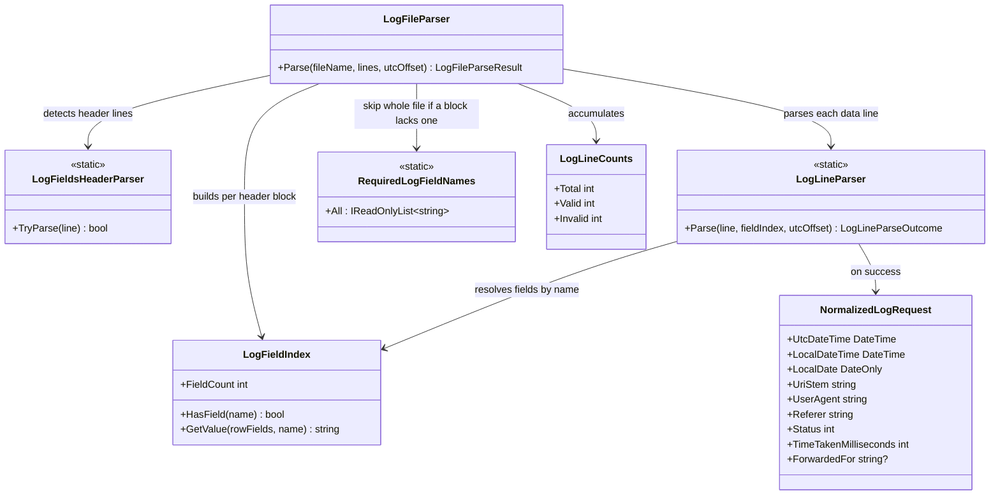

Two skip rules, enforced at different granularities — a bad header ruins the whole file, a bad line only loses itself:

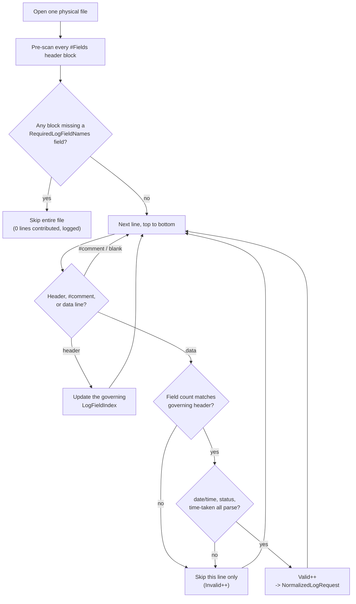

- **Whole file** skipped if any of its header blocks is missing a field required by aggregation ([`RequiredLogFieldNames`](src/IisLogParserArcGIS.Domain/Parsing/RequiredLogFieldNames.cs)) — checked *before* any line is parsed. `X-Forwarded-For` is not in this required set: IIS only logs it when an operator opts in, so a header block that omits it is still valid, and lines it governs simply don't contribute to the by-forwarded-for-IP aggregate.
- **Single line** skipped if its field count doesn't match its *governing* header block's declared count, or a required value (date/time, status, time-taken) fails to parse — one bad line never loses the rest of an otherwise-good file.

### Domain: the ten aggregates

Every aggregator has the same shape — filter `NormalizedLogRequest`s to the target `local_date`, group by a normalized key, sum `time-taken` (ms → s) and count hits:

```mermaid
classDiagram
    class NormalizedLogRequest
    class ByUriAggregator { +Aggregate(requests, date) }
    class ByRootAggregator { +Aggregate(requests, date) }
    class ByUserAgentAggregator { +Aggregate(requests, date) }
    class ByRefererAggregator { +Aggregate(requests, date) }
    class ByForwardedForIpAggregator { +Aggregate(requests, date) }
    class ByRefererAndUriAggregator { +Aggregate(requests, date) }
    class ByArcGisServiceAggregator { +Aggregate(requests, date) }
    class ByPortalItemAggregator { +Aggregate(requests, date, portalWebAdaptorName) }
    class ByFieldMapsDeviceAggregator { +Aggregate(requests, date, portalWebAdaptorName) }
    class BySurvey123DeviceAggregator { +Aggregate(requests, date, portalWebAdaptorName) }

    class UriStemNormalizer { <<static>> }
    class RootNormalizer { <<static>> }
    class RefererNormalizer { <<static>> }
    class ForwardedForIpNormalizer { <<static>> }
    class ArcGisServiceIdentityParser { <<static>> +TryParse(uriStem, out identity) }
    class ArcGisServiceIdentity { +Site +Folder +ServiceName +ServiceType }
    class PortalItemIdentityParser { <<static>> +TryParse(uriStem, portalWebAdaptorName, out portalItemId) }
    class ByPortalItemAggregateRow { +PortalItemId +TimeTakenSecond +Hits +SuccessfulHits +FailedHits }
    class FieldMapsDeviceIdParser { <<static>> +TryParse(userAgent, out deviceId) }
    class Survey123DeviceIdParser { <<static>> +TryParse(userAgent, out deviceId) }
    class LoginLineParser { <<static>> +TryParse(uriStem, portalWebAdaptorName, out username) }
    class DeviceUsageTally { <<internal static>> +ExtractDeviceRequests() +Tally() }
    class ByFieldMapsDeviceAggregateRow { +DeviceId +Username +TimeTakenSecond +Hits }
    class BySurvey123DeviceAggregateRow { +DeviceId +Username +TimeTakenSecond +Hits }

    ByUriAggregator --> NormalizedLogRequest
    ByRootAggregator --> NormalizedLogRequest
    ByUserAgentAggregator --> NormalizedLogRequest
    ByRefererAggregator --> NormalizedLogRequest
    ByForwardedForIpAggregator --> NormalizedLogRequest
    ByRefererAndUriAggregator --> NormalizedLogRequest
    ByArcGisServiceAggregator --> NormalizedLogRequest
    ByPortalItemAggregator --> NormalizedLogRequest
    ByFieldMapsDeviceAggregator --> NormalizedLogRequest
    BySurvey123DeviceAggregator --> NormalizedLogRequest

    ByUriAggregator --> UriStemNormalizer
    ByRootAggregator --> RootNormalizer
    ByRefererAggregator --> RefererNormalizer
    ByForwardedForIpAggregator --> ForwardedForIpNormalizer
    ByRefererAndUriAggregator --> RefererNormalizer
    ByRefererAndUriAggregator --> UriStemNormalizer
    ByArcGisServiceAggregator --> ArcGisServiceIdentityParser
    ArcGisServiceIdentityParser --> ArcGisServiceIdentity
    ArcGisServiceIdentityParser --> RootNormalizer : site reuses root normalization
    ByPortalItemAggregator --> PortalItemIdentityParser
    ByPortalItemAggregator --> ByPortalItemAggregateRow
    ByFieldMapsDeviceAggregator --> FieldMapsDeviceIdParser
    ByFieldMapsDeviceAggregator --> DeviceUsageTally
    DeviceUsageTally --> LoginLineParser
    ByFieldMapsDeviceAggregator --> ByFieldMapsDeviceAggregateRow
    BySurvey123DeviceAggregator --> Survey123DeviceIdParser
    BySurvey123DeviceAggregator --> DeviceUsageTally
    BySurvey123DeviceAggregator --> BySurvey123DeviceAggregateRow
```

`ArcGisServiceIdentityParser` is the most involved rule: it rejects admin/portal paths *by path-segment check*, not by substring match — a request that merely contains "rest" in its path or query string is never mistaken for a real service call. Foldered paths are tried before folderless ones, since both can have three remaining segments and only a foldered path's third segment is itself shaped like a service type (e.g. ends with `Server`):

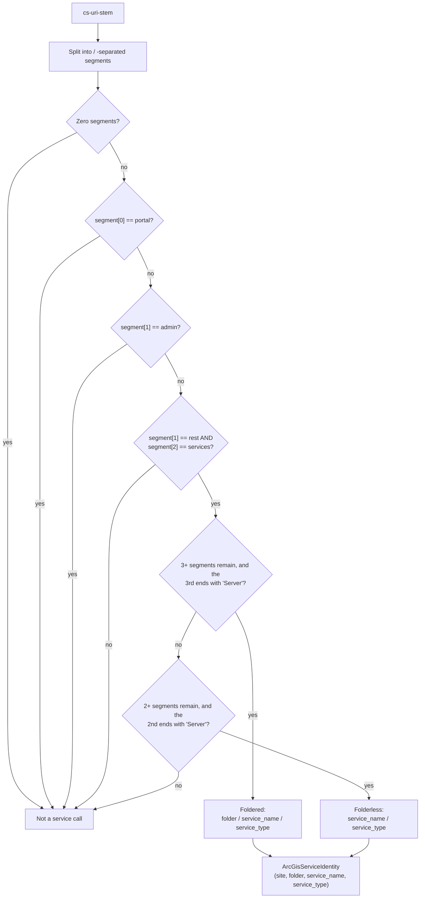

`PortalItemIdentityParser` matches three URL shapes under the configured `PortalWebAdaptorName`, all keyed only on the item id — username and folder id are read structurally to locate `items`/`<id>` and then discarded. A user-scoped bulk operation with no item id in the path (`deleteItems`, `shareItems`) structurally fails to match rather than erroring:

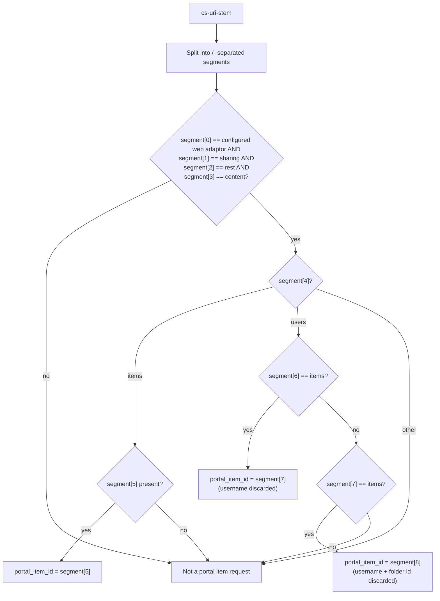

### Domain: Field Maps username matching

`aggregated_by_field_maps_device` answers *who is actually using their ArcGIS Field Maps licence*. Field Maps only reveals the signed-in user when the app starts — it requests `/<web adaptor>/sharing/rest/community/users/<username>` once — and every later request from that device carries no user information. So usage is attributed to a username by device, in two stages:

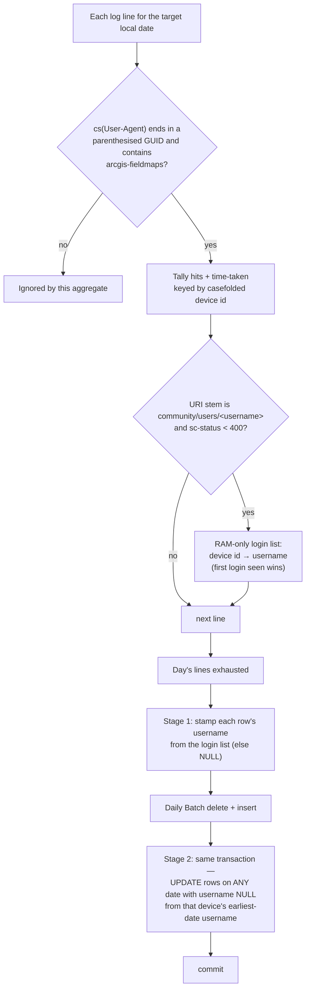

- **The device id** is read from the *end* of the user-agent — the app appends its per-install GUID in parentheses after `arcgis-fieldmaps/<version>+` — so the runtime token, platform group, and device model (which vary widely, and can themselves contain parentheses) are never examined. `FieldMapsDeviceIdParser` only accepts a trailing group that is a well-formed GUID. iOS GUIDs are uppercase and Android GUIDs are lowercase, so ids are casefolded before they are compared or stored.
- **Stage 1** happens in memory inside `ByFieldMapsDeviceAggregator` (the tallying and login-list logic is the app-neutral `DeviceUsageTally`, shared with the Survey123 aggregator). The login list is never persisted. A device with no login that day is kept with a `NULL` username, never dropped.
- **Stage 2** is `ByFieldMapsDeviceRepository.BackfillUsernames`, a single set-based `UPDATE` run by `DailyAggregateReplacer` in the same transaction as the replace. It fills a `NULL` username from the device's earliest-date username (`ORDER BY local_date, username LIMIT 1`, so a device that somehow has several usernames gets exactly one, deterministically), never overwrites an existing username, and is idempotent — so it also attributes *earlier* dates when a later day's harvest brings the login, and harvesting dates in any order ends in the same state (for a device with a single username; see the lent-device note under [Survey123 username matching](#domain-survey123-username-matching)). It intentionally updates rows of other dates, unlike the rest of a Daily Batch.
- A device that never logs in within the harvested history stays `NULL`, so **absence from this table is not evidence a licence is unused** until enough history has been harvested.
- Every harvest logs a `Field Maps attribution:` line: devices seen, attributed by a same-day login, back-filled from another date, and still unattributed.

### Domain: Survey123 username matching

`aggregated_by_survey123_device` is the same two-stage scheme for ArcGIS Survey123 (ticket 21). The stage-1 tally, the login list, the `sc-status < 400` rule, casefolding, the `NULL`-username rows, the set-based stage-2 back-fill (`BySurvey123DeviceRepository.BackfillUsernames`, sharing its SQL with Field Maps through `DeviceAggregateRepositoryBase`) and the `Survey123 attribution:` run-summary line are all identical. Only these differ:

- **A Survey123 request** is one whose user-agent contains **both** `AppFramework` and `Survey123` (case-insensitive). Each alone matches unrelated traffic: `AppFramework` alone is also ArcGIS QuickCapture, `Survey123` alone is the `ArcGISRuntime-Qt/…` embedded variant (no device id), and the browser-based Survey123 web app is identified only by its referer and carries no device id, so only the user-agent field is examined. The Survey123 Connect desktop tool (`Survey123+Connect/<v>`) is included.
- **The device id is not at the end of the user-agent.** It is the last `;+`-separated item of the *first* parenthesised group after `AppFramework/<version>+` (the platform group, e.g. `(iOS+26.1;+en_CA;+arm64;+<id>)`), and is 32 hex digits with no hyphens. `Survey123DeviceIdParser` accepts it only in that shape (`Guid.TryParseExact(…, "N")`) and stores it as logged, lowercased, so it stays greppable against the raw logs.
- **Login lines are `POST`**, not `GET`. The stem is the same `community/users/<username>` (parsed by the shared `LoginLineParser`), and the method is not examined.
- **Lent devices happen here.** Unlike Field Maps, a few Survey123 devices show more than one username over the year. Each device still gets exactly one username for its unattributed rows (the earliest login date's, ties alphabetical), so later usage by a second borrower is attributed to the first user. And because a username is never overwritten, the *final* state for such a device can depend on the order dates were harvested in; the order-independence above holds for every device with a single username.

### Data: replace-per-day persistence

```mermaid
classDiagram
    class AggregateRepositoryBase~TRow~ {
        <<abstract>>
        #InsertSql string
        #DeleteByLocalDateSql string
        #SelectByLocalDateSql string
        +Insert(connection, rows, tx)
        +DeleteByLocalDate(connection, date, tx) int
        +GetByLocalDate(connection, date) IEnumerable~TRow~
    }
    class ByUriRepository
    class ByRootRepository
    class ByUserAgentRepository
    class ByRefererRepository
    class ByForwardedForIpRepository
    class ByRefererAndUriRepository
    class ByArcGisServiceRepository
    class ByPortalItemRepository
    class DeviceAggregateRepositoryBase
    class ByFieldMapsDeviceRepository {
        +BackfillUsernames(connection, tx) int$
    }
    class BySurvey123DeviceRepository {
        +BackfillUsernames(connection, tx) int$
    }
    class DailyAggregateReplacer {
        <<static>>
        +Replace(connection, DailyAggregateBatch)
    }
    class AggregateDatabaseSchema {
        <<static>>
        +EnsureCreated(connection)
    }
    class SqliteConnectionFactory {
        <<static>>
        +Open(path) SqliteConnection
    }

    AggregateRepositoryBase <|-- ByUriRepository
    AggregateRepositoryBase <|-- ByRootRepository
    AggregateRepositoryBase <|-- ByUserAgentRepository
    AggregateRepositoryBase <|-- ByRefererRepository
    AggregateRepositoryBase <|-- ByForwardedForIpRepository
    AggregateRepositoryBase <|-- ByRefererAndUriRepository
    AggregateRepositoryBase <|-- ByArcGisServiceRepository
    AggregateRepositoryBase <|-- ByPortalItemRepository
    AggregateRepositoryBase <|-- DeviceAggregateRepositoryBase
    DeviceAggregateRepositoryBase <|-- ByFieldMapsDeviceRepository
    DeviceAggregateRepositoryBase <|-- BySurvey123DeviceRepository

    DailyAggregateReplacer --> ByUriRepository : delete + insert, same tx
    DailyAggregateReplacer --> ByRootRepository
    DailyAggregateReplacer --> ByUserAgentRepository
    DailyAggregateReplacer --> ByRefererRepository
    DailyAggregateReplacer --> ByForwardedForIpRepository
    DailyAggregateReplacer --> ByRefererAndUriRepository
    DailyAggregateReplacer --> ByArcGisServiceRepository
    DailyAggregateReplacer --> ByPortalItemRepository
    DailyAggregateReplacer --> ByFieldMapsDeviceRepository : + BackfillUsernames, same tx
    DailyAggregateReplacer --> BySurvey123DeviceRepository : + BackfillUsernames, same tx
```

`DailyAggregateReplacer.Replace` opens one transaction, deletes the target date's rows from all ten tables, inserts the freshly computed rows, runs the Field Maps and Survey123 username back-fills (below), and commits — a crash mid-run rolls everything back, so a day is never left half-updated. Dapper executes hand-written SQL directly (no ORM/change-tracking) via `Microsoft.Data.Sqlite`; see [ADR 0001](docs/adr/0001-sqlite-for-aggregate-store.md) and [ADR 0002](docs/adr/0002-dapper-repository-and-query-split.md).

### Reports: Dashboard generation

`RegenerationRun.Run` is the Reports project's one entry point ([`RegenerationRun.cs`](src/IisLogParserArcGIS.Reports/RegenerationRun.cs)): resolve this run's year-to-date boundaries, delete and recreate the output directory (always a full rebuild — [ADR 0005](docs/adr/0005-pregenerate-dashboard-as-static-html.md)), write the shared static assets (`site.css`, `dashboard.js`), then call eleven Section Builders in sequence (the three per-device builders each run twice, once for Fieldmaps and once for Survey123), each independently querying `Data` and writing its own page(s):

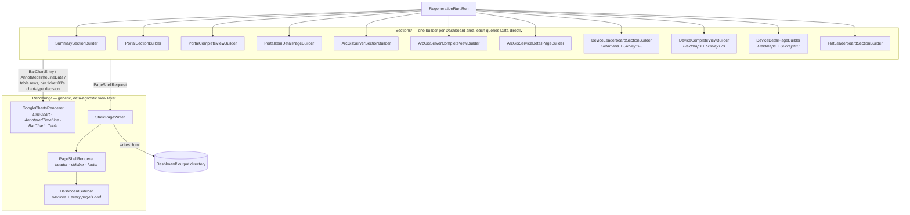

- **The Dashboard's site map** (the sidebar, in order): **Summary**, **Portal**, **ArcGIS Server** (one group per Included Root), **Fieldmaps**, **Survey123**, **Leaderboard**. Portal, Fieldmaps and Survey123 render unconditionally — none is gated or filtered by `IncludedRoots`. Fieldmaps reports *usage by Field Maps device* (hits and time taken; no success/failure split): `Leaderboard: Hits` (a Top-50 bar chart, one bar per device labelled `username · full-device-id`, All and Last 7 Days as separate pages), a `Complete View` (every device, attributed or not, with a sortable **Last Seen** column for licence validation) and, reached only from that Complete View's Detail Page column, one per-device Detail Page charting the device's hits per day with an in-page All / Last 7 Days toggle. A database created before the Field Maps table existed still renders the section, with empty-data cards. **Survey123** is the same section again over `aggregated_by_survey123_device` (`survey123/…` paths, 32-hex device ids): the same three page types, built by the same three per-device builders parameterized over a `DeviceSection` (table, title, slug), so the two sections cannot drift apart and never show each other's devices.
- **Sections owns "what to show," Rendering owns "how to draw it."** A Section Builder never emits a `<div>` or a `google.charts` call itself — it queries `Data`, shapes the result into a `BarChartEntry`/`AnnotatedTimeLineData`/table-row list, and hands it to `GoogleChartsRenderer`. `GoogleChartsRenderer` has no idea what a "Leaderboard" or a "Root" is.
- **Every chart is one of four Google Charts widgets**, picked once per report shape and never mixed: `LineChart` (Summary's all-Roots-overlaid total), `AnnotatedTimeLine` (every single-series evolution chart — successful/failed hits, average time), `BarChart` (every Top-50 Leaderboard), `Table` (every Complete View). A "Failed"-scoped chart draws in red via an optional `ChartTone` parameter (`RenderBarChart`/`RenderAnnotatedTimeLine`) rather than a second code path.
- **No HTML templating engine.** Every page is generated from C# raw string literals interpolated directly in the render methods — no `.cshtml`/`.scriban`/`.mustache` files on disk, no reflection-based model binding. This is deliberate, not an omission: every value embedded into a page (a `cs-uri-stem`, a user agent, a referer) ultimately derives from unauthenticated request data with no character allow-listing at ingest time, and the Dashboard itself has no login ([ADR 0006](docs/adr/0006-no-authentication-on-dashboard.md)) — so every interpolation goes through `JsonSerializer.Serialize`'s default HTML-safe encoder, and every C# expression inside a template is compiler-checked. A templating engine that doesn't auto-escape for an HTML context would reopen exactly the injection risk this design closes.
- **`PageShellRequest` is the one contract** every Section Builder produces and `StaticPageWriter` consumes: title, output-relative path, active sidebar entry, body HTML, and whether the page needs the Google Charts CDN loader. `PageShellRenderer` wraps that body in the shared header/sidebar/footer; `DashboardSidebar` is the single source of truth for the nav tree *and* every page's own href (so a link and the sidebar entry it points at can never drift apart).
- **`IncludedRoots` filtering lives here, not in the parser** ([ADR 0007](docs/adr/0007-root-allow-listing-lives-in-reports-project.md)) — the aggregate database keeps every Root IIS ever saw; a Regeneration Run decides which ones are worth showing.

### Cross-cutting patterns worth knowing before you read the code

- **Optional `ILoggerFactory`, null-object fallback** ([ADR 0003](docs/adr/0003-optional-loggerfactory-with-null-fallback.md)): every logging-capable class in Host, Domain, and Data takes an `ILoggerFactory? loggerFactory = null` constructor parameter and falls back to `NullLoggerFactory.Instance`. Every log call site is unconditionally safe, and any class can be constructed in a unit test with zero logging setup. Reports doesn't participate — it has no logging-capable classes of its own; a Regeneration Run's own failures surface through `Program.cs`'s existing exception handling instead.
- **Correlation IDs**: while processing a raw line, `{filename}:{line-number}` is pushed into Serilog's log context, so any warning/error traces straight back to the source line that caused it.
- **Fail loudly**: zero log files found for the required date(s) is a hard failure — clear stderr message, exit code 1 ([`NoLogFilesFoundException`](src/IisLogParserArcGIS/FileDiscovery/NoLogFilesFoundException.cs)). Same treatment for CLI validation errors and configuration/database initialization failures — see the `catch` clauses in [`HarvestRunner.cs`](src/IisLogParserArcGIS/Cli/HarvestRunner.cs), [`RegenerateRunner.cs`](src/IisLogParserArcGIS/Cli/RegenerateRunner.cs) and [`DashboardRegenerator.cs`](src/IisLogParserArcGIS/Cli/DashboardRegenerator.cs).

## Testing strategy

| Project | What it exercises | I/O |
| --- | --- | --- |
| `IisLogParserArcGIS.Domain.Tests` | Every parsing rule and all ten aggregators, against small synthetic log-line fixtures — positive *and* negative case each (field-count mismatch, missing required header field, a header omitting the optional `X-Forwarded-For` field, foldered/folderless ArcGIS URLs, admin/portal exclusion, the three Portal item-access URL shapes vs. ID-less bulk operations, `+`-encoded fields, multi-value X-Forwarded-For, …). | None |
| `IisLogParserArcGIS.Data.Tests` | Repositories/Queries against a real temp-file SQLite database — idempotent schema creation, that a replace is genuinely transactional (a simulated mid-replace failure leaves the prior day untouched), internal `hits`/`successful_hits`/`failed_hits` consistency. | Real SQLite file |
| `IisLogParserArcGIS.Tests` | Host-specific logic not covered elsewhere — CLI argument validation, configuration binding, logging setup. | None |
| `IisLogParserArcGIS.Reports.Tests` | Every Section Builder's output, from a shared `HarvestedAggregateDatabaseFixture` — a real aggregate database built once per test run by actually harvesting a slice of the gitignored `2026/` log corpus, not a synthetic fixture. Asserts on the generated HTML's structure: sidebar entries, page counts, chart/table presence, Detail Page links. | Real files, real SQLite, real harvested database |
| `IisLogParserArcGIS.RegressionTests` | The **compiled executable**, run as a subprocess against the checked-in, anonymized `2026/` log corpus — asserting only on exit code, the stdout run summary, and rows queried from the output database. Covers the corpus's confirmed 16-vs-18-field schema drift, multi-header-block files, and site-ID rotation. Independent of, and slower than, the other three. | Real files, real subprocess, real SQLite |

`RegressionTests` doesn't pick its dates arbitrarily — each one targets a specific, confirmed real-world condition in the corpus:

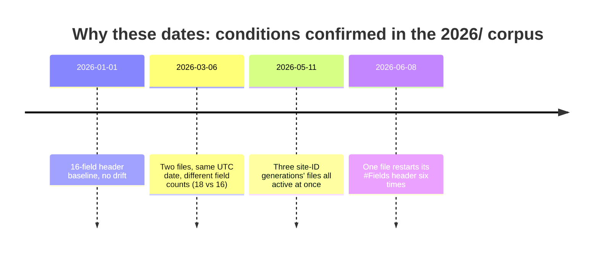

Every class in `src/` has a matching test class in the corresponding `tests/` project (except the intentionally separate `RegressionTests`, per [ADR 0004](docs/adr/0004-solution-layout-mirrored-tests.md)) — a coverage gap is visible just by comparing the two trees.

```powershell
dotnet test IisLogParserArcGIS.slnx                                    # everything
dotnet test tests/IisLogParserArcGIS.Domain.Tests                       # fast, no I/O
dotnet test tests/IisLogParserArcGIS.Reports.Tests                      # uses the checked-in 2026/ corpus (harvests into a real fixture database)
dotnet test tests/IisLogParserArcGIS.RegressionTests                    # uses the checked-in 2026/ corpus + a prior build
```

## Where to look

| I want to change/understand... | Start here |
| --- | --- |
| CLI arguments / validation | [`src/IisLogParserArcGIS/Cli/`](src/IisLogParserArcGIS/Cli/) |
| Config binding / defaults | [`src/IisLogParserArcGIS/Configuration/AppConfigurationFactory.cs`](src/IisLogParserArcGIS/Configuration/AppConfigurationFactory.cs) |
| Which UTC file(s) a local day needs | [`RequiredUtcDatesCalculator.cs`](src/IisLogParserArcGIS.Domain/FileDiscovery/RequiredUtcDatesCalculator.cs) |
| The actual filesystem glob | [`LogFileLocator.cs`](src/IisLogParserArcGIS/FileDiscovery/LogFileLocator.cs) |
| Header parsing / field-by-name resolution | [`LogFieldsHeaderParser.cs`](src/IisLogParserArcGIS.Domain/Parsing/LogFieldsHeaderParser.cs), [`LogFieldIndex.cs`](src/IisLogParserArcGIS.Domain/Parsing/LogFieldIndex.cs) |
| One line's parse/skip logic | [`LogLineParser.cs`](src/IisLogParserArcGIS.Domain/Parsing/LogLineParser.cs) |
| A specific aggregate's rule | `src/IisLogParserArcGIS.Domain/Aggregation/By*Aggregator.cs` (one file per dimension) |
| ArcGIS service path parsing | [`ArcGisServiceIdentityParser.cs`](src/IisLogParserArcGIS.Domain/Aggregation/ArcGisServiceIdentityParser.cs) |
| Portal item path parsing | [`PortalItemIdentityParser.cs`](src/IisLogParserArcGIS.Domain/Aggregation/PortalItemIdentityParser.cs) |
| SQL / schema for a table | `src/IisLogParserArcGIS.Data/Repositories/By*Repository.cs`, [`AggregateDatabaseSchema.cs`](src/IisLogParserArcGIS.Data/Schema/AggregateDatabaseSchema.cs) |
| The atomic daily replace | [`DailyAggregateReplacer.cs`](src/IisLogParserArcGIS.Data/Replacement/DailyAggregateReplacer.cs) |
| Logging setup / rolling file | [`SerilogLoggerFactoryBuilder.cs`](src/IisLogParserArcGIS/Logging/SerilogLoggerFactoryBuilder.cs) |
| The end-of-run summary | [`RunSummaryReporter.cs`](src/IisLogParserArcGIS/Logging/RunSummaryReporter.cs) |
| Verb parsing and dispatch | [`Program.cs`](src/IisLogParserArcGIS/Program.cs) |
| Orchestration of a verb (exit codes, error messages) | [`HarvestRunner.cs`](src/IisLogParserArcGIS/Cli/HarvestRunner.cs), [`RegenerateRunner.cs`](src/IisLogParserArcGIS/Cli/RegenerateRunner.cs), [`DashboardRegenerator.cs`](src/IisLogParserArcGIS/Cli/DashboardRegenerator.cs) |
| Dashboard generation entry point | [`RegenerationRun.cs`](src/IisLogParserArcGIS.Reports/RegenerationRun.cs) |
| A specific Dashboard area's content/queries | `src/IisLogParserArcGIS.Reports/Sections/*SectionBuilder.cs`, `*CompleteViewBuilder.cs`, `*DetailPageBuilder.cs` (one builder per area) |
| Chart HTML/JS (LineChart, AnnotatedTimeLine, BarChart, Table) | [`GoogleChartsRenderer.cs`](src/IisLogParserArcGIS.Reports/Rendering/GoogleChartsRenderer.cs) |
| Red-for-failed chart coloring | [`ChartTone.cs`](src/IisLogParserArcGIS.Reports/Rendering/ChartTone.cs) |
| Page shell (header/sidebar/footer), site.css, dashboard.js | [`PageShellAssets.cs`](src/IisLogParserArcGIS.Reports/Rendering/PageShellAssets.cs), [`PageShellRenderer.cs`](src/IisLogParserArcGIS.Reports/Rendering/PageShellRenderer.cs) |
| The nav tree / a page's own href | [`DashboardSidebar.cs`](src/IisLogParserArcGIS.Reports/Rendering/DashboardSidebar.cs) |
| Reports-specific config (`IncludedRoots`, `PortalBaseUrl`, `ArcGisServerBaseUrl`, …) | [`ReportsSettings.cs`](src/IisLogParserArcGIS.Reports/Configuration/ReportsSettings.cs) |

## Further reading

- [`requirements.md`](requirements.md) — the detailed, per-aggregate parsing/normalization contract.
- [`CONTEXT.md`](CONTEXT.md) — project vocabulary (Hit, Daily Batch, Root/Site, Successful/Failed Hit, …).
- [`docs/adr/`](docs/adr/) — architecturally significant decisions (SQLite choice, Dapper/Repository split, logger-factory pattern, solution layout, static-HTML Dashboard, no Dashboard auth, Root allow-listing).
- [`.scratch/iis-log-parser/spec.md`](.scratch/iis-log-parser/spec.md) — the originating feature spec and user stories for the parser/aggregation side.
- [`.scratch/iis-log-parser/issues/`](.scratch/iis-log-parser/issues/) — one file per parser/aggregation implementation ticket, each with a `Status:` and `## Comments` history.
- [`.scratch/iis-log-reports/spec.md`](.scratch/iis-log-reports/spec.md) — the originating feature spec for the Dashboard/Reports side.
- [`.scratch/iis-log-reports/issues/`](.scratch/iis-log-reports/issues/) — one file per Dashboard/Reports implementation ticket.
- [`TOOLSET.md`](TOOLSET.md) — the static-analysis/tooling baseline (StyleCop, NetAnalyzers, CleanCoders.Analyzers, VS Threading Analyzers), not this project's own behavior.
